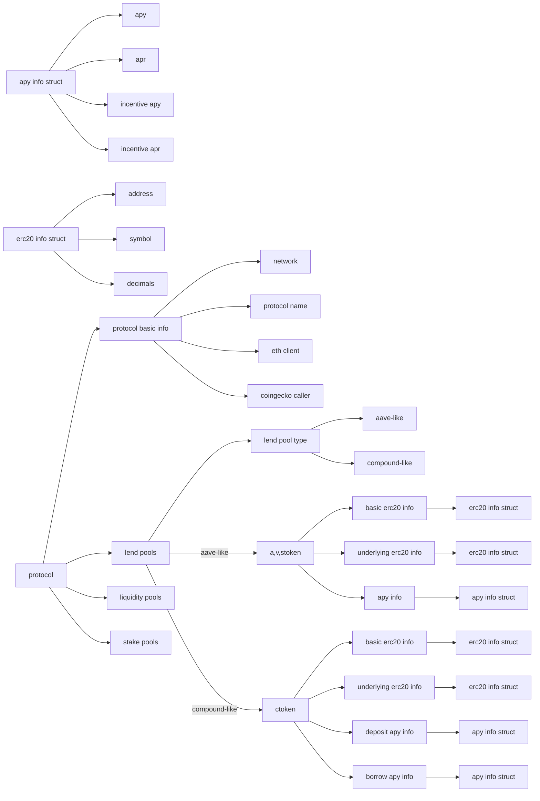

# Protocols

Not updated and not updating. 

Due to Coingecko request frequency limit, it will not always work properly.

Maybe will be deprecated.

## Targets

-   Pool

    -   tokens

    -   lp

    -   apys(apr)

    -   volume (day)

    -   tvl

    -   otherinfo(platypus)

    -   userinfo

        -   deposited

        -   ?

-   Lend

    -   atoken

        -   basic

        -   underlying

    -   vtoken

        -   basic

        -   underlying

    -   stoken

        -   basic

        -   underlying

    -   ctoken

        -   basic

        -   underlying

    -   deposit apys(apr)

    -   borrow apys(apr)

    -   collateral factor

    -   liquidation limit

    -   allow borrow

    -   allow collateral

    -   liquidation penalty

-   Stake

    -   tokens

    -   stake contract

    -   volume

    -   tvl

    -   apys(apr)
